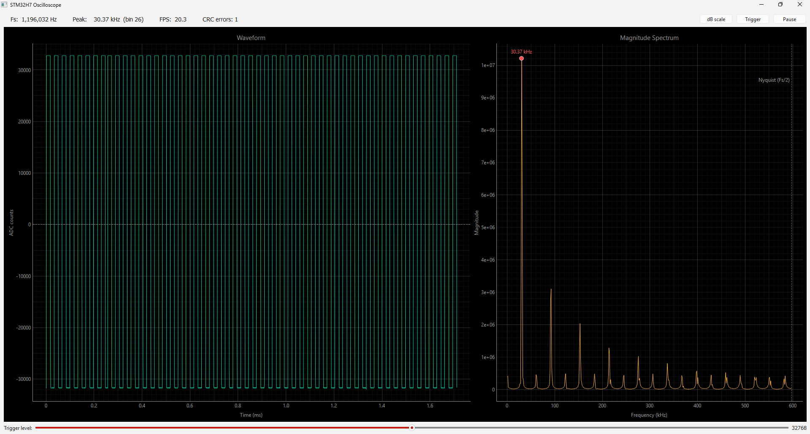
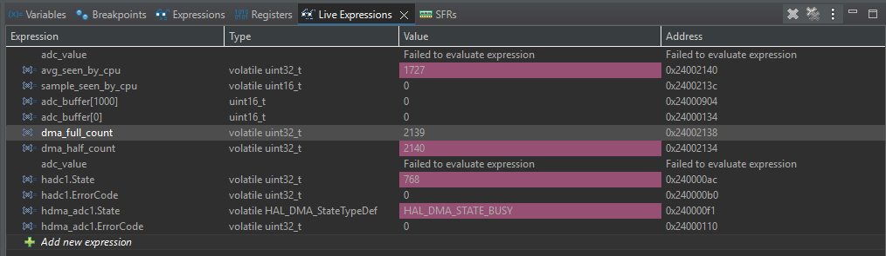
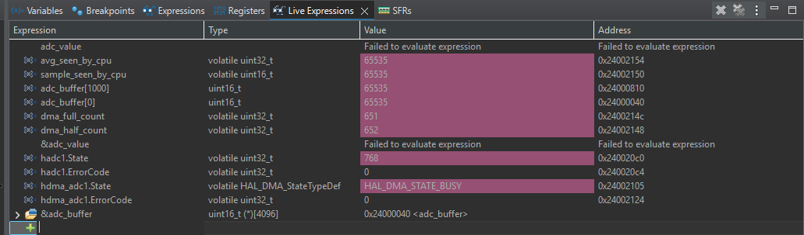

# STM32H7 Real-Time Oscilloscope

Real-time digital oscilloscope on a NUCLEO-H753ZI. An analog signal on PA3 is sampled at ~1.2 MSa/s by a 16-bit ADC, captured via DMA into an SRAM ring buffer, processed by a FreeRTOS task pipeline that runs a 1024-point FFT using CMSIS-DSP, and streamed over USB CDC as binary frames to a Python pyqtgraph viewer.



## Hardware

- NUCLEO-H753ZI
- Analog input on PA3 (Arduino A0, CN9 pin 1), 0–3.3 V single-ended
- SYSCLK 480 MHz via PLL1 at VOS0, HCLK 240 MHz, ADC kernel 80 MHz via PLL2P, HSI48 for USB
- Two micro-USB cables during development: CN1 (ST-LINK, flashing and debug) and CN13 (OTG-FS, the CDC data stream)

## Architecture

```
                             ┌─────────────────────────────────────┐
                             │  NUCLEO-H753ZI @ 480 MHz, VOS0      │
                             │                                     │
   PA3 ──► ADC1_INP15 ──► DMA1 ──► AXI SRAM 0x24002000 (8 KB)      │
       (16-bit, 8.5-cycle       (circular, half+full IRQ)          │
        sampling, ~1.2 MSa/s)       │    │                         │
                                    │    │                         │
                                    ▼    ▼                         │
                         ┌──────────────────────────────────┐      │
                         │  Half/Full transfer ISRs         │      │
                         │  osSemaphoreRelease(adcDataSem)  │      │
                         └──────────────────────────────────┘      │
                                    │                              │
                                    ▼                              │
                 ┌───────────────────────────────┐                 │
                 │  AcquisitionTask  (High)      │                 │
                 │  sem acquire → queue put      │                 │
                 └───────────────────────────────┘                 │
                                    │ osMessageQueuePut            │
                                    ▼                              │
                 ┌───────────────────────────────┐                 │
                 │  ProcessingTask  (Normal)     │                 │
                 │  Hann * 1024 samples →        │                 │
                 │  arm_rfft_fast_f32 →          │                 │
                 │  arm_cmplx_mag_f32 →          │                 │
                 │  snapshot to latest_{samples, │                 │
                 │  magnitudes, results}         │                 │
                 └───────────────────────────────┘                 │
                                    │                              │
                                    ▼                              │
                 ┌───────────────────────────────┐                 │
                 │  defaultTask (Low) @ 30 Hz    │                 │
                 │  build binary frame →         │                 │
                 │  CDC_Transmit_FS (6167 B)     │                 │
                 └───────────────────────────────┘                 │
                                    │                              │
                                    ▼                              │
                            USB_OTG_FS (CN13)                      │
                             │                                     │
                             └─────────────────────────────────────┘
                                    │
                                    ▼  ~180 KB/s @ 30 Hz
                             ┌──────────────────────┐
                             │   Python viewer      │
                             │  pyserial reader →   │
                             │  FrameParser (CRC)   │
                             │  → pyqtgraph @ Qt    │
                             │  timer 30 Hz redraw  │
                             └──────────────────────┘
```
*Diagram drawn with [AsciiFlow](https://asciiflow.com).*

Three tasks, priorities in parentheses. AcquisitionTask (High) blocks on a semaphore released from both the DMA half-transfer and full-transfer ISRs, then posts which buffer half is fresh to a queue. ProcessingTask (Normal) pulls from the queue, applies a precomputed Hann window, runs `arm_rfft_fast_f32`, computes magnitudes, finds the peak bin, and snapshots the results for the coms task to read. The default task (Low) wakes at 30 Hz, assembles a binary frame from the latest snapshots, and sends it via `CDC_Transmit_FS`. Priorities enforce the property that sampling never drops even if the host stalls or the FFT is slow.

HAL's timebase was moved off SysTick to TIM6 because FreeRTOS owns SysTick. Stacks were tuned after a HardFault during bring-up (see Notes).

## Cache coherency on the STM32H7

The STM32H7 has a 16 KB L1 D-cache that earlier STM32 parts don't, and the naive DMA pattern from Cortex-M4-era tutorials produces broken results on it.

The problem is that DMA writes directly to SRAM, bypassing the CPU's cache. When the CPU later reads the DMA buffer, it can hit a stale cache line from a previous read rather than the new DMA-written data. The CPU and the DMA master genuinely disagree about what is in memory.

I reproduced this deliberately during bring-up to confirm the failure mode. With D-cache enabled and no MPU region, the debugger (which reads memory through a path that bypasses the CPU cache) showed live values changing while the CPU's reads from the same addresses stayed frozen or lagged badly. The worst version was the sum-then-divide loop: with some cache lines fresh and others not, it produced a valid arithmetic average over a buffer that had never existed as a coherent snapshot.

**Before — D-cache on, no MPU region:**



**After — buffer placed in an MPU-carved non-cacheable region:**



There are three real approaches to this. The first is an MPU non-cacheable region over the DMA buffer: D-cache stays on for everything else but the specific region containing `adc_buffer` is marked non-cacheable, so CPU accesses to it go straight to SRAM. This is what this project uses. The second is manual cache maintenance calls (`SCB_InvalidateDCache_by_Addr` before reading, `SCB_CleanDCache_by_Addr` before letting DMA consume). This works but is fragile — one forgotten call and the bug returns silently, and all buffers have to be 32-byte aligned. The third is to disable D-cache entirely, which is the tutorial-grade non-fix that gives up a meaningful chunk of CPU performance.

One subtlety about the MPU approach: on Cortex-M7 the region base address must be a multiple of the region size, so an 8 KB region requires an 8 KB-aligned base. After adding FreeRTOS and USB the buffer landed at `0x24000040` (not aligned), and the MPU silently accepted the invalid configuration — it caused a HardFault at random times during streaming rather than immediately at boot. Forcing `ALIGN(8192)` on the `.adc_buffer` linker section pins the buffer to `0x24002000` regardless of future RAM layout changes.

## Binary frame protocol

Little-endian, 6167 bytes per frame, sent at ~30 Hz. Roughly 180 KB/s.

```
[0xAA 0x55]                  sync (2)
[type=0x01]                  frame type (1)
[payload_len:u16 = 6160]     (2)
[tick:u32]                   MCU ms tick
[sample_rate:u32]            Hz
[peak_bin:u32]
[peak_mag:f32]
[samples:u16 × 2048]         raw 16-bit ADC (DC centered at 32768)
[magnitudes:f32 × 512]       |FFT| per bin, Hann-windowed
[crc16_ccitt:u16]            over type + length + payload
```

CRC16-CCITT with polynomial `0x1021` and init `0xFFFF`. The sync bytes, length, and CRC let the Python parser resync cleanly after a mid-stream restart or a viewer reconnect. In steady state the CRC error counter stays in the single digits (only startup artifacts, when the parser opens the port mid-frame).

## Benchmarks

Measured on the live hardware.

| Metric | Value |
|--|--|
| SYSCLK | 480 MHz |
| HCLK | 240 MHz |
| ADC sample rate, measured from DMA full-transfer count | ~1.2 MSa/s |
| Host-side throughput, `pyserial.read()` over 3 s | 173 KB/s |
| Steady-state frame rate | 30 Hz |
| End-to-end latency, buffer-complete to plot update | ≈50 ms |
| CRC errors after 5 min | single digits (startup only) |

Sample rate is verified two ways: the MCU counts its own `dma_full_count` per second and publishes it, and the Python viewer derives the same number from the per-frame `sample_rate` field. They agree.

## Results

Feeding a 30 kHz 50%-duty square wave from a 555 astable into PA3 produces full rail-to-rail capture in the time domain and a textbook spectrum with the fundamental at 30 kHz plus odd harmonics (3f, 5f, 7f, …) falling off as 1/n. This is exactly what Fourier says a square wave should look like, which is the best proof I have that the FFT path is honest.

The peak-bin-to-frequency mapping `peak_hz = peak_bin × Fs / N` agrees sub-bin with a known input. With the 555 tuned to 33.7 kHz and Fs ≈ 1.2 MSa/s, N = 1024, peak_bin reads 29 (expected 29.2).

## Building and running

### Firmware

1. Open `firmware/` as an STM32CubeIDE project (1.15+).
2. Build (hammer icon). Expects a clean compile with the bundled ARM GCC 14.x.
3. Flash via Run or Debug over ST-LINK (CN1).
4. The green LD1 should start toggling at roughly 30 Hz once the firmware is running.

### Host viewer

```bash
cd host
python -m venv .venv
.venv\Scripts\activate        # Windows
# source .venv/bin/activate   # macOS/Linux

pip install -r requirements.txt
python viewer.py              # defaults to COM3
python viewer.py COM7         # explicit port
```

The viewer window has the waveform on the left and the magnitude spectrum on the right with a red peak marker. The top-right buttons are dB scale (20·log10 y-axis), Trigger (rising-edge lock with level set by the bottom slider), and Pause. Right-click on either plot for zoom and pan; the view locks after the first frame so manual zoom persists across redraws.

A small `host/read.py` exists as a raw-throughput smoke test that opens the port, reads for 3 seconds, and prints bytes per second.

## Limitations

Bin resolution is `Fs/N ≈ 1172 Hz`, so signals below a few kHz land too close to DC to resolve well on the spectrum — the wideband MSa/s design inherently trades low-frequency resolution. A future version could add a parallel decimated FFT pipeline for an audio-band zoom. Single channel only, as scoped from day one. Triggering is software-side in the Python viewer; a real scope would do hardware triggering with pre- and post-trigger buffers on the MCU. There's no input protection on PA3 — anything over 3.3 V risks the ADC's clamp diodes, so a real front-end would include a divider plus clamping diodes plus an op-amp buffer. Finally, the coms task reads `latest_samples` while the processing task may be mid-memcpy into it; the race is invisible in practice at 30 Hz but a mutex would close it cleanly.

## Notes from bring-up

A few things that cost real time and might be useful to someone else attempting this:

**Stack overflow in a FreeRTOS task HardFaults from inside a queue or semaphore primitive**, not at the overflow point. With `CHECK_FOR_STACK_OVERFLOW` off, the debugger stopped inside `memcpy` two calls down into `xQueueReceive`, which looked like a corrupted queue rather than an overflowed task stack. It was actually the processing task blowing its 2 KB limit because `arm_rfft_fast_f32` uses substantial stack for intermediate buffers. Bumping it to 4 KB fixed it immediately.

**Sample rate needs instrumentation, not derivation.** Working backwards from "FFT peak bin plus known input frequency" produced inconsistent Fs numbers across runs because of 555 drift and bin quantization. Counting DMA completions per second and exposing a `measured_sample_rate` gave unambiguous ground truth.

**"Works in PuTTY" does not test a CDC streaming pipeline.** PuTTY holds the port open but does not drain it fast enough. `usb_tx_busy_drops` stayed pinned near the transmit rate until a Python consumer was actually reading bytes, at which point it settled near zero.

**USB CDC text is great for a heartbeat; binary frames with sync + length + CRC are necessary for real streaming.** The framing exists specifically so the parser can cleanly resume after a disconnect or mid-stream startup.

## Repository layout

```
firmware/       CubeIDE project (C, FreeRTOS, CMSIS-DSP, USB CDC)
host/           Python viewer and throughput test
docs/           screenshots referenced above
```